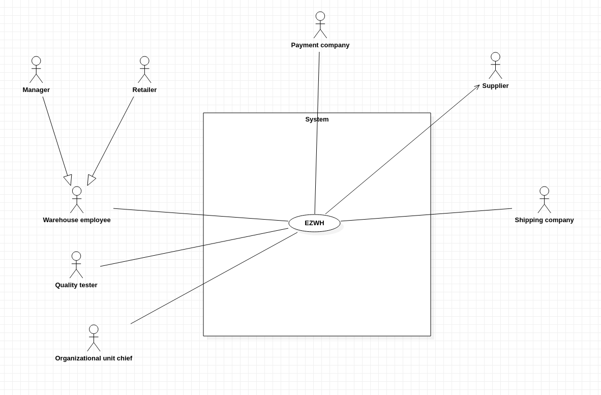
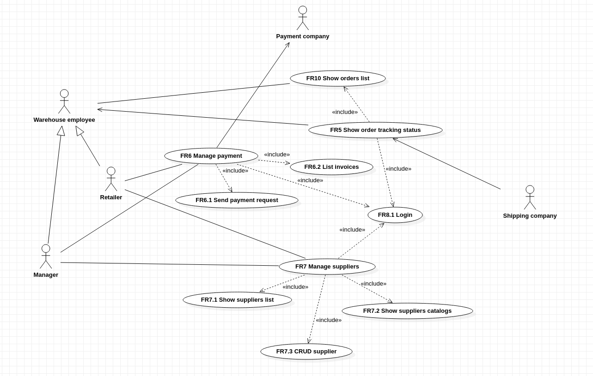
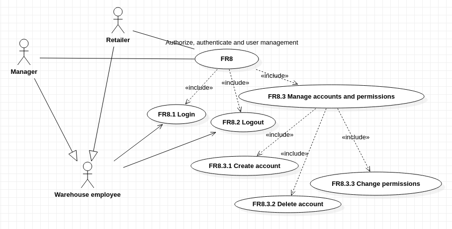
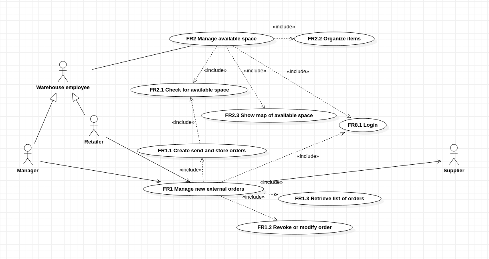
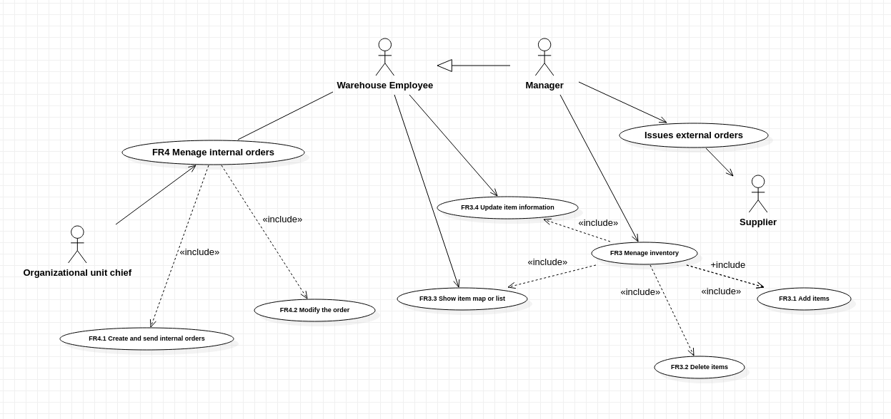
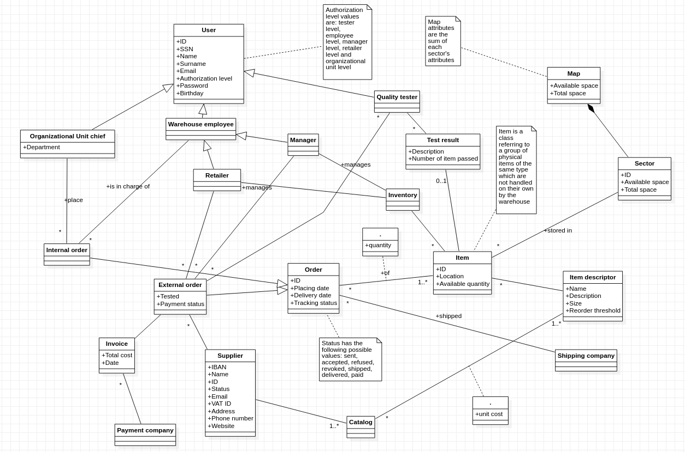
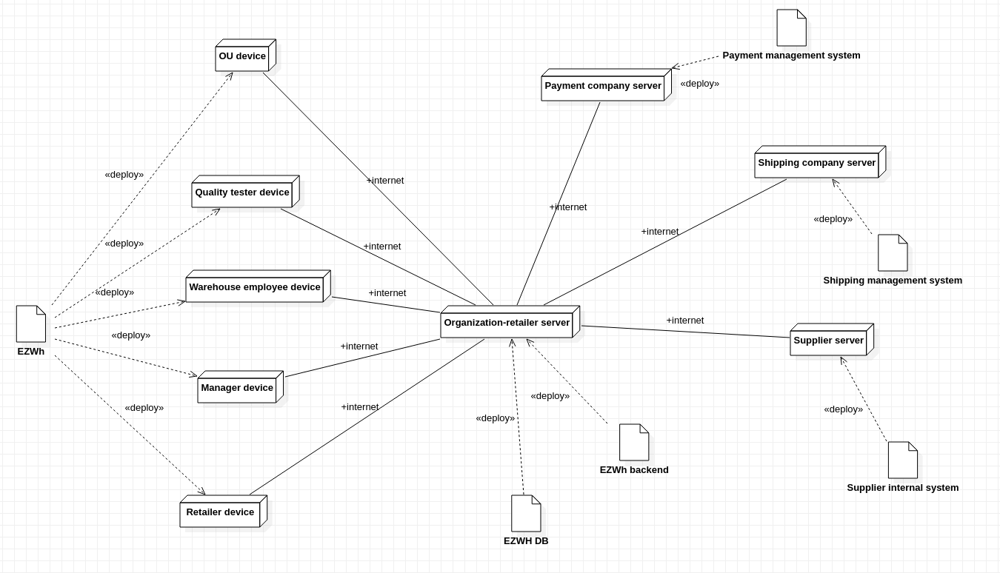

 #Requirements Document 

Date: 22 march 2022

Version: 1.0

 
| Version number | Change |
| ----------------- |:-----------|
| 1.0 | Added stakeholders, actors, interfaces, stories and personas, functional requirements and non functional requirements ,use cases and scenarios, system design |
| 2.0 | Added context diagram, use cases diagram, glossary and deployment diagram |
| 2.1 | "Organizational Units" renamed to "Organizational Unit chief", edited glossary | 

# Contents

- [Informal description](#informal-description)
- [Stakeholders](#stakeholders)
- [Context Diagram and interfaces](#context-diagram-and-interfaces)
	+ [Context Diagram](#context-diagram)
	+ [Interfaces](#interfaces) 
	
- [Stories and personas](#stories-and-personas)
- [Functional and non functional requirements](#functional-and-non-functional-requirements)
	+ [Functional Requirements](#functional-requirements)
	+ [Non functional requirements](#non-functional-requirements)
- [Use case diagram and use cases](#use-case-diagram-and-use-cases)
	+ [Use case diagram](#use-case-diagram)
	+ [Use cases](#use-cases)
    	+ [Relevant scenarios](#relevant-scenarios)
- [Glossary](#glossary)
- [System design](#system-design)
- [Deployment diagram](#deployment-diagram)

# Informal description
Medium companies and retailers need a simple application to manage the relationship with suppliers and the inventory of physical items stocked in a physical warehouse. 
The warehouse is supervised by a manager, who supervises the availability of items. When a certain item is in short supply, the manager issues an order to a supplier. In general the same item can be purchased by many suppliers. The warehouse keeps a list of possible suppliers per item. 

After some time the items ordered to a supplier are received. The items must be quality checked and stored in specific positions in the warehouse. The quality check is performed by specific roles (quality office), who apply specific tests for item (different items are tested differently). Possibly the tests are not made at all, or made randomly on some of the items received. If an item does not pass a quality test it may be rejected and sent back to the supplier. 

Storage of items in the warehouse must take into account the availability of physical space in the warehouse. Further the position of items must be traced to guide later recollection of them.

The warehouse is part of a company. Other organizational units (OU) of the company may ask for items in the warehouse. This is implemented via internal orders, received by the warehouse. Upon reception of an internal order the warehouse must collect the requested item(s), prepare them and deliver them to a pick up area. When the item is collected by the other OU the internal order is completed. 

EZWH (EaSy WareHouse) is a software application to support the management of a warehouse.

# Stakeholders

| Stakeholder name                                                | Description                                                                              |
|-----------------------------------------------------------------|------------------------------------------------------------------------------------------|
| Manager (administrator)                                         | The person who is in charge of the final order and the supervisor of warehouse employees |
| Quality tester                                                  | It's in charge of items acceptance                                                       |
| Supplier                                                        | People who provide ordered items                                                         |
| Organizational unit chief (production/manufacturing office chief, IT area chief) | People placing internal orders                                                         |
| Warehouse employee                                              | People organizing the warehouse, managing available space and items already stored in it |
| Retailer                                                        | Small shops with a small warehouse that need to be managed                               |
| Payment company                                                 | Organization in charge of managing transactions                                          |
| Shipping company                                                | Organization in charge of delivering items                                               |

# Context Diagram and interfaces

## Context Diagram

## Interfaces

| Actor                | Logical Interface    | Physical Interface               |
|----------------------|----------------------|----------------------------------|
| Retailer             | GUI                  | Device screen                    |
| Manager              | GUI                  | Device screen                    |
| Warehouse employee   | GUI                  | Device screen                    |
| Organizational unit chief | GUI, command line    | Device screen, keyboard, computer|
| Payment company      | API                  | Internet connection              |
| Supplier             | Email or web service | Internet connection              |
| Shipping company     | API                  | Internet connection              |
| Quality tester       | GUI                  | Device screen                    |

# Stories and personas
Ylenia is 23 and works as employee in the warehouse of a confectionary manufacturer company.
She advices her manager to switch to a new software she heard about in order to manage better the inventory and reduce the waste of prducts.
On top of that, she would like some functionalities like item mapping, sorting list and internal order management in order to increase the productivity of the warehouse and its employees.

Ginevra is 30, she is the CEO of an italian clothes brand. Her dream is to increase the workflow of the company and interactions between warehouses, design offices and manufactures around Italy. Ginevra wants also an application with a privileged access to all the catalogues, the inventory and to manage orders with suppliers. She is going to invest money in EZWH software to reach her business goal.

Mr. Giancarlo is the manager of a supermarket warehouse. The warehouse stores every kind of product, from fresh food to electronics, so keeping track of every type of product is really important but kinda hard.
He returns home every day around 10pm because he has to contact 1 by 1 every supplier in order to make new orders for the warehouse and his wife does not like his long working shifts.
Mr. Giancarlo would immediatley start using an application that could help him sending new orders to suppliers in just some clicks and going back home for dinner.

Carmelo is 64 years old and owns a small family business in Castellamare di Stabia. Everything was going good, until the abrupt rising of all these new technologies.
Now suppliers are asking for digital payments, identies and certifications but Carmelo doesn't understand a thing.
His nephew bought him a new smartphone and installed on it EZWH app. Carmelo was able to understand how EZWH works in just a couple of hours and 
now he will have no more problems with payments.

Jhonny is probably going to quit his job. He is a quality tester for Lorem Ipsum GmbH, but since the company has been acquired from Big G the workload doubled.
He dreams about an app that could help him keeping track of all the test he makes and those he still has to make in order to simplify the work and increase its productivity without becoming crazy.

# Functional and non functional requirements

## Functional Requirements

| ID      | Description                                                            |
|---------|------------------------------------------------------------------------|
| FR1     | Manage new external orders                                             |
| FR1.1   | Create order, send it to the supplier and store it                     |
| FR1.1.1 | Revoke or modify order                                                 |
| FR2     | Manage available space                                                 |
| FR2.1   | Check for space available                                              |
| FR2.2   | Organize items, so that people can easily access them                  |
| FR2.3   | Show a map of available space                                          |
| FR3     | Manage inventory                                                       |
| FR3.1   | Add new item stored                                                    |
| FR3.2   | Delete item from stock                                                 |
| FR3.3   | Show item map or list (with different filters and sorting criteria)    |
| FR3.4   | Update item information (quantity, location etc)                       |
| FR4     | Manage internal orders                                                 |
| FR4.1   | Create order and send it to the nearest warehouse or to a specific one |
| FR4.2   | Modify or revoke order                                                 |
| FR5     | Show order tracking status                                             |
| FR6     | Manage payment                                                         |
| FR6.1   | Send payment request                                                   |
| FR6.2   | List invoices                                                          |
| FR7     | Manage suppliers                                                       |
| FR7.1   | Show suppliers list                                                    |
| FR7.2   | Show suppliers catalogs                                                |
| FR7.3   | CRUD supplier                                                          |
| FR8     | Authorize, authenticate and user management                            |
| FR8.1   | Login                                                                  |
| FR8.2   | Log out                                                                |
| FR8.3   | Manage accounts and permissions                                        |
| FR8.3.1 | Create, Delete account and change permissions                          |
| FR9     | Manage quality tests                                                   |
| FR9.1   | Store, add test results                                                |
| FR9.2   | Show tests results                                                     |
| FR10    | Show orders list                                                       |

## Non Functional Requirements

| ID   | Type            | Description                                                                                                               | Refers to     |
|------|-----------------|---------------------------------------------------------------------------------------------------------------------------|---------------|
| NFR3 | Usability       | The new user with basic permissions should be able to learn the basics in maximum 30 mins.                                | All FR        |
| NFR4 | Usability       | The new user with full permissions should be able to learn all functions in less than an hour.                            | All FR        |
| NFR2 | Efficiency      | All data download should take less than 0.1s and data should be displayed in less than 1s, including data retrieving part | FR2, FR3, FR5 |
| NFR2 | Efficiency      | Used memory should be <= 700 MB                                                                                           | All FR        |
| NFR3 | Reliability     | No wrong payment should happen                                                                                            | FR6           |
| NFR6 | Reliability     | The system must make a remote backup of all database information every three days                                         | All FR        |
| NFR5 | Reliability     | The number of crashes should be <= 1 per 6 Months                                                                         | All FR        |
| NFR4 | Maintainability | Number of FTE spent on fixing usage bugs should be less than 30 per year                                                  | All FR        |
| NFR5 | Portability     | The app should work on 4 operating systems                                                                                | All FR        |
| NFR6 | Security        | The app has to give the right permissions to users                                                                        | All FR        |

# Use case diagram and use cases

## Use case diagram

### UC1 Create new order
| Actors involved  | Manager |
|-|-|
| Precondition | Manager M is logged in |
| Postcondition | An order O is sent to the supplier S |
| Nominal Scenario | The manager M checks there is enough space in the warehouse. Selects the supplier S, the item I and the quantity Q and send the order |
|Variants | The manager M place again an order retrieving it form the order list |
| Exceptions | There is not enough free space in the warehouse. The supplier can not accept more orders (maybe it's too busy). The selected quantity is higher than the supplier's available quantity |

Scenario 1.1
| Scenario | The order is placed |
|-|-|
| Precodition | Manager M is logged in |
| Postcondition | An order O is sent to the supplier S |
| Step# | Description |
| 1 | Manager M selects the supplier S he wants to contact |
| 2 | Manager M selects the item I he wants to buy |
| 3 | Manager M selects the desired quantity Q |
| 4 | The application checks available space |
| 5 | The order O is placed and sent to the supplier S |
| 6 | Supplier S sends a notification N of received order O |

Scenario 1.2
| Scenario | The order is placed again from the order's list |
|-|-|
| Precodition | Manager M is logged in |
| Postcondition | An order O is sent to the supplier S |
| Step# | Description |
| 1 | Manager M selects an old order O from the history of orders |
| 2 | The application checks available space |
| 3 |The order O is placed and sent to the supplier S |
| 4 | Supplier S sends a notification N of received order O |

Scenario 1.3
| Scenario | The space available is not enough |
|-|-|
| Precodition | Manager M is logged in |
| Postcondition | Order O is aborted |
| Step# | Description |
| 1 | Manager M selects the supplier S he wants to contact |
| 2 | Manager M selects the item I he wants to buy |
| 3 | Manager M selects the desired quantity Q |
| 4 | The application checks available space |
| 2 | Not enough space is available so the order O is aborted |

Scenario 1.4
| Scenario | The supplier can not take more orders |
|-|-|
| Precodition | Managaer M is logged in |
| Postcondition | Order O is aborted |
| Step# | Description |
| 1 | Manager M selects the supplier S he wants to contact |
| 2 | The supplier S is shown as "not operative" in the supplier's list |

Scenario 1.5
| Scenario | The selected quantity Q is higher than the supplier's available quantity Q |
|-|-|
| Precodition | Manager M is logged in |
| Postcondition | Order O is frozen |
| Step# | Description |
| 1 | Manager M selects the supplier S he wants to contact |
| 2 | Manager M selects the item I he wants to buy |
| 3 | Manager M selects the desired quantity Q |
| 4 | The application checks available space |
| 5 | The order O is frozen by the supplier S. If the manager M decreases the quantity Q the order can be placed |

### UC2 Modify order
| Actors involved | Manager |
|-|-|
| Precondition | Manager is logged in. An order O is already placed |
| Postcondition | An updated order UO is sent to the supplier |
| Nominal Scenario | The manager checks there is enough space in the warehouse. Selects an existing order O and updates the quantity Q or change the item I |
| Variants | - |
| Exceptions | There is not enough free space in the warehouse. The selected quantity is higher than the supplier's available quantity. The order is already in shipping state. |

Scenario 2.1
| Scenario | The order O is updated |
|-|-|
| Precondition | Manager is logged in. An order O is already placed |
| Postcondition | An updated order UO is sent to the supplier |
| Step# | Description |
| 1 | Manager M selects the order O |
| 2 | Manager M updates the order O with new values of quantity Q or item I |
| 3 | The application checks available space |
| 4 | Supplier S receives the update order UO and accepts it |
| 5 | Supplier S sends a notification N of received  updated order UO |

Scenario 2.2
| Scenario | The space available is not enough |
|-|-|
| Precodition | Managaer M is logged in. An order O is already placed |
| Postcondition | Order O is not updated |
| Step# | Description |
| 1 | Manager M selects the order O |
| 2 | Manager M updates the order O with new values of quantity Q or item I |
| 3 | The application checks available space |
| 4 | Manager M can not increase quantity Q because of a lack of free space |

Scenario 2.3
| Scenario | The selected quantity Q is higher than the supplier's available quantity Q |
|-|-|
| Precodition | Manager M is logged in. An order O is already placed |
| Postcondition | Order O is not updated |
| Step# | Description |
| 1 | Manager M selects the order O |
| 2 | Manager M updates the order O with new values of quantity Q or item I |
| 3 | The application checks available space |
| 4 | Supplier S receives the update but rejects it because the desired quantity Q for item I is not available |
| 5 | Supplier S sends a notification N of rejected updated order UO |

Scenario 2.4
| Scenario | The order has already been sent to supplier |
|-|-|
| Precodition | Managaer M is logged in. An order O is already placed |
| Postcondition | Order O is not updated |
| Step# | Description |
| 1 | Manager M selects the order O |
| 2 | Manager M updates the order O with new values of quantity Q or item I |
| 3 | The application checks available space |
| 4 | Supplier S receives the update but rejects it because the order has already been sent |
| 5 | Supplier S sends a notification N of rejected updated order UO |

### UC3 Revoke order
| Actors involved | Manager |
|-|-|
| Precondition | Manager M is logged in. An order O is already placed |
| Postcondition | The order O is revoked |
| Nominal Scenario | The manager M selects the order O and revokes it |
| Variants | The supplier S has already sent the order O |

Scenario 3.1
| Scenario | The order O is revoked |
|-|-|
| Precondition | Manager M is logged in. An order O is already placed |
| Postcondition | The order O is revoked |
| Step# | Description |
| 1 | Manager M selects an order O and sends a revoke request to the supplier S |
| 2 | Supplier S receives the revoke request |
| 3 | Supplier S cancels the order O |
| 4 | Supplier S sends a notification N of revoked order O |

Scenario 3.2 
| Scenario | The order O is sent |
|-|-|
| Precondition | Manager M is logged in. An order O is already placed |
| Postcondition | The order O is sent |
| Step# | Description |
| 1 | Manager M selects an order O and sends a revoke request to the supplier S |
| 2 | Supplier S receives the revoke request |
| 3 | Supplier S does not cancel the order O |
| 4 | Supplier S sends a notification N of already sent order O |

### UC4 Show map of avaliable space
| Actors involved | Generic user (Warehouse employee, Retailer, Manager) |
|-|-|
| Precondition | User U is logged in |
| Postcondition | Map MP is shown on screen |
| Nominal Scenario | The user U choose to see the entire map MP|
| Variants | The user U choose a specific sector |
| Exceptions | The warehouse has not been mapped or updated. |

Scenario 4.1
| Scenario | User U wants to see the entire map MP |
|-|-|
| Precondition | User U is logged in |
| Postcondition | Entire map MP is shown on screen |
| Step# | Descrption |
| 1 | User U wants to see the entire map MP |
| 2 | The map MP is shown on screen |

Scenario 4.2
| Scenario | User U wants to see a specific map MP sector |
|-|-|
| Precondition | User U is logged in |
| Postcondition | Map MP sector is shown on screen |
| Step# | Descrption |
| 1 | User U wants to see a specific map MP sector |
| 2 | The map MP sector is shown on screen |

Scenario 4.3
| Scenario | Map MP is not present |
|-|-|
| Precondition | User U is logged in |
| Postcondition | No map MP is shown on screen |
| Step# | Descrption |
| 1 | User U wants to see the entire map MP or a specific map MP sector |
| 2 | The warehouse has not been mapped |
| 3 | A notification N is is sent to the user U of no map MP available |

Scenario 4.4
| Scenario | Map MP is not updated |
|-|-|
| Precondition | User U is logged in |
| Postcondition | Old map MP is shown on screen |
| Step# | Descrption |
| 1 | User U wants to see the entire map MP or a specific map MP sector |
| 2 | The warehouse map MP has not been uèdated |
| 3 | A notification N is is sent to the user U of no up to date map MP available |

### UC5 Add items to the inventory
| Actors Involved        | Manager |
| ------------- |:-------------:| 
|  Precondition     | Manager M logged in and the inventory of the warehouse exists (empty or not) |
|  Post condition     | New items added to the warehouse inventory |
|  Nominal Scenario     | M adds new items to the inventory |
|  Variants     | - |
|  Exceptions     | - |

| Nominal Scenario | |
| ------------- |:-------------:| 
|  Precondition     | Manager M logged in and the inventory of the warehouse exists (empty or not) |
|  Post condition     | New item I added to the warehouse inventory |
| Step#        | Description  |
|  1     | M opens the tab related to the inventory management |  
|  2     | M press the button to add item I inside the inventory |
|  3     | M confirms the operation |
|  4	 | Item I is added to the inventory |

### UC6 Delete items from the inventory
| Actors Involved        | Manager |
| ------------- |:-------------:| 
|  Precondition     | Manager logged in and the inventory with items exists |
|  Post condition     | Items deleted from the warehouse inventory |
|  Nominal Scenario     | M deletes items from the inventory |
|  Variants     | - |
|  Exceptions     | - |

| Nominal Scenario | |
| ------------- |:-------------:| 
|  Precondition     | Manager M logged in and the inventory with items exists |
|  Post condition     | Item I deleted from the warehouse inventory |
| Step#        | Description  |
|  1     | M opens the tab related to the inventory management |  
|  2     | M search item I from the list and press the button to delete item I |
|  3     | M confirms the operation |
|  4	 | Item I is deleted from the inventory |

### UC7 Create and sent an internal order
| Actors Involved        | Warehouse Employee and Organizational Unit chief OUC |
| ------------- |:-------------:| 
|  Precondition     | Internal Order does not exist |
|  Post condition     | Internal Order  is created and sent |
|  Nominal Scenario     | OUC places the order, employee E collects the items, sets up them for the shipping and delivers them to a pick up area  |
|  Variants     | - |
|  Exceptions     | Not enough quantity available |

| Nominal Scenario | |
| ------------- |:-------------:| 
|  Precondition     | Internal Orderm IO does not exist, employee E and OUC logged in |
|  Post condition     | Internal Order IO is created and sent |
| Step#        | Description  |
|  1     | OUC creates internal order IO |  
|  2     | E takes charge of internal order IO|
|  3     | When IO is completed it is sent |
|  4	 | Number of items automatically decreased from the warehouse inventory by the EZWH system |

| Exception | |
| ------------- |:-------------:| 
|  Precondition     | Internal Order IO does not exist, employee E and OUC logged in |
|  Post condition     | Internal Order IO is rejected |
| Step#        | Description  |
|  1     | OUC creates an internal order |  
|  2     | E takes charge of internal order IO |
|  3     | IO cannot be completed by E because the requested quantity of items is not available in the warehouse |
|  4	 | E reject internal order IO |

### UC8 Modify or revoke an internal order
| Actors Involved        | Organisational Unit chief OUC |
| ------------- |:-------------:| 
|  Precondition     | Internal Order exist and it is not shipped yet |
|  Post condition     | Internal Order is modified or removoked |
|  Nominal Scenario     | OUC provides an update for an internal order or revokes it  |
|  Variants     | - |
|  Exceptions     | An error occurs if the internal order is already shipped |

| Nominal Scenario | |
| ------------- |:-------------:| 
|  Precondition     | Internal Order IO exists, OUC logged in |
|  Post condition     | Internal Order IO is modified or removoked |
| Step#        | Description  |
|  1     | OUC selects internal order IO created before |  
|  2     | If order IO results not sent yet, OUC can modify or revoke it |
|  3     | Changes are visible also to the E of the warehouse who doesn't process order IO or change it |

| Exception | |
| ------------- |:-------------:| 
|  Precondition     | Internal Order IO exists, OUC logged in |
|  Post condition     | Internal Order IO is not modified or removoked |
| Step#        | Description  |
|  1     | OUC selects internal order IO created before |  
|  2     | IO is already in "sent" status |
|  3     | IO can't be modified or revoked |

### UC9 Show order tracking status
| Actors Involved  | Warehouse employee, shipping company                                                  |
|------------------|-------------------------------------------------------------------------------------------------|
| Precondition     | An order must be placed, accepted and sent by the supplier and accepted by the shipping company. User must be logged in. |
| Post condition   | Full description of tracking status available                                                   |
| Nominal Scenario | The user open the application and he's able to view the tracking status of all the orders       |
| Variants         | Sort orders by delivery date, by order size                                                     |
| Exceptions       | Shipping company doesn't provide tracking information                                           |

| Nominal scenario |                                                                                                                                                       |
|------------------|-------------------------------------------------------------------------------------------------------------------------------------------------------|
| Precondition     | Order O must be placed, accepted and sent by supplier SUP and accepted by shipping company SP. Warehouse employee WE or retailer R must be logged in. |
| Post condition   | Full description of O tracking status available                                                                                                       |
| 1                | WE or R wants to view tracking status for order O, so it access the area dedicated to tracking information                                            |
| 2                | The list of all available orders is shown to WE or R                                                                                                  |
| 3                | WE or R selects order O                                                                                                                               |
| 4                | Tracking information is shown to WE or R                                                                                                              |

| Exception1 scenario |                                                                                                                                                       |
|---------------------|-------------------------------------------------------------------------------------------------------------------------------------------------------|
| Precondition        | Order O must be placed, accepted and sent by supplier SUP and accepted by shipping company SP. Warehouse employee WE or retailer R must be logged in. |
| Post condition      | Error has been shown to warn WE or R                                                                                                                  |
| 1                   | WE or R wants to view tracking status for order O, so it access the area dedicated to tracking information                                            |
| 2                   | The list of all available orders is shown to WE or R                                                                                                  |
| 3                   | WE or R selects order O                                                                                                                               |
| 4                   | SP doesn't provide tracking information, so an error is shown on order O                                                                              |

### UC10 Manage payment

| Actors Involved  | Retailer or manager and payment company                                                                                                              |
|------------------|------------------------------------------------------------------------------------------------------------------------------------------------------|
| Precondition     | Retailer or manager must be logged in and order information must have been entered                                                                   |
| Post condition   | Operation successfully performed                                                                                                                     |
| Nominal Scenario | The retailer or the manager wants to handle a payment or view the history of all the payments, so he accesses the application and he manages payments|
| Variants         | Sorting invoices by different criteria, choosing bank account to use                                                                                 |
| Exceptions       | Wrong bank information entered, payment refused, internal errors fetching data                                                                       |

| Send payment request |                                                                                                                             |
|------------------|-----------------------------------------------------------------------------------------------------------------------------|
| Precondition     | Retailer R or manager M must be logged in and order O information must have been entered                                    |
| Post condition   | Operation successfully performed                                                                                            |
| 1                | R or M wants to place or confirm order O, so R or M open the application and accesses the right area                        |
| 2                | R or M confirms or place order O selecting the payment method                                                               |
| 3                | Payment request is sent to the payment company                                                                              |
| 4                | Successful payment operation notification delivered                                                                         |
| 5                | A message warns R or M that the operation was successful                                                                    |

| List invoices |                                                                                                                             |
|------------------|-----------------------------------------------------------------------------------------------------------------------------|
| Precondition     | Retailer R or manager M must be logged in and order O information must have been entered                                    |
| Post condition   | Operation successfully performed                                                                                            |
| 1                | R or M wants to view the history of all the payments, so R or M open the application and accesses the right area            |
| 2                | Information about all payments is retrieved                                                                                 |
| 3                | Invoices list is shown                                                                                                      |

| Payment refused |                                                                                                                             |
|---------------------|-----------------------------------------------------------------------------------------------------------------------------|
| Precondition        | Retailer R or manager M must be logged in and order O information must have been entered                                    |
| Post condition      | Error notification successfully shown                                                                                       |
| 1                   | R or M wants to place or confirm order O, so R or M open the application and accesses the right area                        |
| 2                   | R or M confirms or place order O selecting the payment method                                                               |
| 3                   | Payment request is sent to the payment company                                                                              |
| 4                   | Abort payment notification delivered                                                                                        |
| 5                   | A message warns R or M that the operation was not performed                                                                 |

| Internal errors fetching data |                                                                                                                             |
|------------------|-----------------------------------------------------------------------------------------------------------------------------|
| Precondition     | Retailer R or manager M must be logged in and order O information must have been entered                                    |
| Post condition   | Error notification successfully shown                                                                                       |
| 1                | R or M wants to view the history of all the payments, so R or M open the application and accesses the right area            |
| 2                | Information about all payments is not retrieved due to internal errors                                                      |
| 3                | Error message is shown                                                                                                      |

### UC11 Manage suppliers

| Actors Involved  | Retailer, manager                                                                       |
|------------------|-----------------------------------------------------------------------------------------|
| Precondition     | Retailer or manager must be logged in                                                   |
| Post condition   | Successful operation performed                                                          |
| Nominal scenario | Retailer or manager wants to edit the suppliers list or retrieve information about them |
| Variants         | Sorting list by different criteria                                                      |
| Exceptions       | Operations are not performed because of internal errors|

| CRUD supplier    |                                                                    |
|------------------|--------------------------------------------------------------------|
| Precondition     | Retailer R or manager M must be logged in                          |
| Post condition   | Successful operation performed                                     |
| 1                | R or M wants to retrieve, update, create or remove suppliers information |
| 2                | R or M open the application and accesses the right area            |
| 3                | Information about suppliers is retrieved and shown                 |
| 4                | R or M selects the operation he/she wants to perform on supplier S |
| 5                | Supplier S in created, edited or deleted                           |
| 6                | Operation successful message shown                                 |

| Show supplier list    |                                                                    |
|------------------|--------------------------------------------------------------------|
| Precondition     | Retailer R or manager M must be logged in                          |
| Post condition   | Successful operation performed                                     |
| 1                | R or M wants see the suppliers list                                 |
| 2                | R or M open the application and accesses the right area            |
| 3                | Information about suppliers is retrieved and shown                 |

| Show suppliers catalogs |                                                                    |
|------------------|--------------------------------------------------------------------|
| Precondition     | Retailer R or manager M must be logged in                          |
| Post condition   | Successful operation performed                                     |
| 1                | R or M wants see the supplier S catalog                            |
| 2                | R or M open the application and accesses the right area            |
| 3                | Information about suppliers is retrieved and shown                 |
| 4                | Supplier S is selected and show catalog operation is selected as well|
| 5                | Supplier S catalog is shown                                        |

| Exception1 scenario |                                                                           |
|---------------------|---------------------------------------------------------------------------|
| Precondition        | Retailer R or manager M must be logged in                                 |
| Post condition      | Error message successfully shown                                          |
| 1                   | R or M wants to retrieve, update, create or remove suppliers information  |
| 2                   | R or M open the application and accesses the right area                   |
| 3                   | Information about suppliers is not retrieved because of an internal error |
| 4                   | Abort operation message shown                                             |

| Exception2 scenario |                                                                         |
|---------------------|-------------------------------------------------------------------------|
| Precondition        | Retailer R or manager M must be logged in                               |
| Post condition      | Error message successfully shown                                        |
| 1                   | R or M wants to retrieve, update, create or remove suppliers information|
| 2                   | R or M open the application and accesses the right area                 |
| 3                   | Information about suppliers is retrieved and shown                      |
| 4                   | R or M selects the operation he/she wants to perform on supplier S      |
| 5                   | Supplier S in not created, edited or deleted because of internal errors |
| 6                   | Abort operation message shown                                           |

### UC12 Manager manages user accounts

| Actors Involved  | Manager, Warehouse employee, Retailer                                                                                                                                                             |
|------------------|---------------------------------------------------------------------------------------------------------------------------------------------------------------------------|
| Precondition     | There is one manager or retailer account                                                                                                                               |
| Post condition   | Changes done are propagated to the database successfully                                                                                                                  |
| Nominal Scenario | Manager creates a new account for a new warehouse employee, modifies the permissions of an existing account or deletes the account of a former employee                                                                                                                                            |
| Exceptions       | User (email, Id) already exists |

| Scenario 1.1   | Manager adds new employee                                   |
|----------------|-----------------------------------------------------------|
| #Step          | Description                                               |
| 1              | Manager log in using his credentials                        |
| 2              | Navigate to accounts management page (interface GUI)      |
| 3              | Click on the add new user button                          |
| 4              | Fill new user data (name, surname, password...) |
| 5              | Manager Chooses the correct permissions for the new user    |
| 6              | Manager press finish (user is added successfully)           |

| Scenario 1.2 | Change permissions for an existing user              |
|--------------|------------------------------------------------------|
| #Step        | Description                                          |
| 1            | Manager log in using his credentials                   |
| 2            | Navigate to accounts management page (interface GUI) |
| 3            | Manager selects the targeted user from the users list  |
| 4            | Selects edit user                                    |
| 5            | Modifies the permissions as needed                   |
| 6            | Click finish (user permissions modified)             |

| Scenario 1.3 | Manager Removes former employee's account |
|--------------|------------------------------------------------------------|
| #Step        | Description                                                |
| 1            | Manager log in using his credentials                         |
| 2            | Navigate to accounts management page (interface GUI)       |
| 3            | Manager selects the targeted user from the users list        |
| 4            | Selects delete user                                        |
| 5            | Click finish (User removed)                                |

| Scenario 1.4 | (Exception scenario) |
|--------------|------------------------------------------------------------|
| #Step        | Description                                                |
| 1            | Manager log in using his credentials                         |
| 2            | Navigate to accounts management page (interface GUI)       |
| 5            | Fill new user data (name, surname, username, password...) |
| 6            | Manager Chooses the correct permissions for the new user    |
| 7            | Manager press finish (user is added successfully)           |
| 8            | Error (User name-Id-email already exists) |
| 9            | Change duplicate data or check for already existing account |

### UC13 Quality tests managements

| Actors Involved  | Manager|
|:------------------:|:------------------------:|
| Precondition     | Items are in the warehouse, Quality tester logged in, Manager logged in |
| Post condition   | Order is accepted or revoked |
| Nominal Scenario | Quality tester adds/removes test results, Manager accepts/revokes order based on the tests result |
| Variants | Accepting orders that don't need quality tests |

| Scenario 2.1 | Quality tester (QT) adds a test result, Manager (M) accepts/refuses the order |
|--------------|-------------------------------------------------------------------------------------|
| #Step        | Description                                                                         |
| 1            | QT choose the order under tests from the list of orders                             |
| 2            | QT selects the tested item from the items in the order                              |
| 3            | QT adds new test result                                                             |
| 4            | Repeat steps 3,4 for all items in the order as needed                               |
| 5            | QT signals the order as tested                                                      |
| 6            | M Opens the order details from the orders list                                      |
| 7            | M signals the order as accepted/refused and order items are added to the warehouse database if the order is accepted |

### UC14 Show orders list

| Actors Involved  | Warehouse employee                                                                                        |
|------------------|-----------------------------------------------------------------------------------------------------------|
| Precondition     | Warehouse employee must be logged in                                                                      |
| Post condition   | List of orders is shown                                                                                   |
| Nominal scenario | Warehouse employee wants to see the list of orders placed, so accesses the application and check the list |
| Variants         | Different sorting criteria                                                                                |
| Exceptions       | Failed retrieving orders                                                                                  |

| Nominal scenario |                                                |
|------------------|------------------------------------------------|
| Precondition     | Warehouse employee WE must be logged in        |
| Post condition   | List of orders is shown                        |
| 1                | Warehouse employee WE accesses the application |
| 2                | WE goes to the right area                      |
| 3                | Orders information is retrieved                |
| 4                | Orders list is shown                           |

| Exception1 scenario |                                                            |
|---------------------|------------------------------------------------------------|
| Precondition        | Warehouse employee WE must be logged in                    |
| Post condition      | List of orders is shown                                    |
| 1                   | Warehouse employee WE accesses the application             |
| 2                   | WE goes to the right area                                  |
| 3                   | Orders information is not retrieved due to internal errors |
| 4                   | Error message is shown                                     |

# Glossary

<<<<<<< HEAD

=======

>>>>>>> 876d5219e96d2195368ae686f32e5dd4851f8f16

# System Design

Not really meaningful in this case.  Only software components are needed.

# Deployment Diagram 

